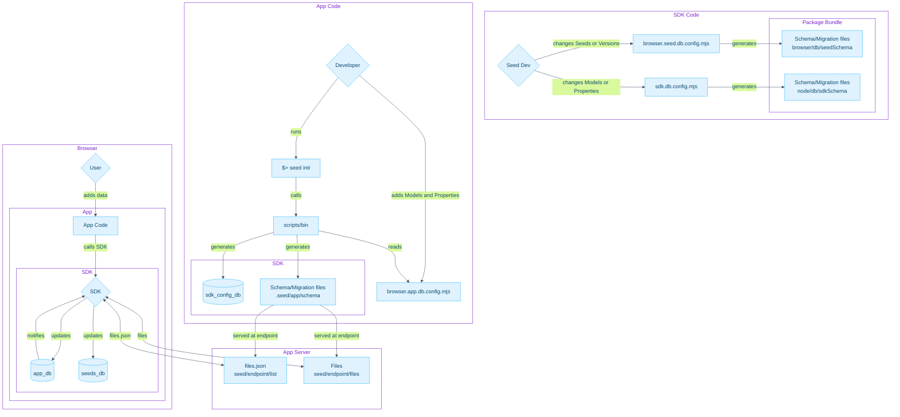

# [WIP] Seed Protocol SDK

This API is a work in progress. It is not yet ready for production use. These docs are for keeping the community informed
and generating feedback.

## Current research questions

- Can we use TypeORM backed by Sqlite Wasm for more performant and future-proof storage?
  - Track this research here: [TypeORM Sqlite Wasm](https://github.com/JournoDAO/typeorm-sqlite-wasm)
- What would the tooling look like to allow export of data model as ProtoBuf and/or JSON Schema?
  - Looking at [ts-proto](https://github.com/stephenh/ts-proto) for Typescript 

## Installing

This package is not yet published to npm, but when it is, this will be the command to install it:

```bash
yarn add @seedprotocol/sdk
```

## Getting Started

The first thing to do when integrating Seed SDK is define you data model. 

For example, let's pretend we're creating a blog that uses Seed Protocol as its content store. We start by defining our `Models`, their `Properties`, and what type of data each `Property` is expecting.

```typescript=
import {Model, Property, List, createStore} from '@seedprotocol/sdk'


const Image = Model({
      storageTransactionId: Property.String(),
      uri: Property.String(),
      alt: Property.String(),
    },)

const Link = Model({
  url: Property.String(),
  text: Property.String(),
},)

const Identity = Model({
  name: Property.String(),
  bio: Property.String(),
  avatarImage: Image,
},)

const Post = Model({
  title: Property.String(),
  summary: Property.String(),
  featureImage: Image,
  html: Property.String(),
  json: Property.String(),
  authors: Property.List(Identity,),
},)

createStore({
  Identity,
  Image,
  Link,
  Post,
},)
```

This will create a database locally in the browser with all the tables and fields necessary to support your Models. Feel free to check it out for yourself in your browser's Dev Tools.

Notice that we create relationships by defining a `Property` that takes its related Model as its type. For one-to-many relationships, we use the `List` type and pass in the `Model` type we want.

So creating a Post would look like this:

```typescript=
import {Post, Image, Identity} from './seed/models'
import html from './index.html'

const image = await Image.create({
    src: 'https://imgr.com/image.jpg',
})

const author = await Identity.create({
    name: 'Keith Axline',
    profile: 'Developer for Seed Protocol',
})

const authors = [
    author
]

const post = await Post.create({
    title: 'Some title',
    summary: 'My summary',
    featureImage: image,
    authors,
})

await post.publish()

// And later when we want to update the post
post.title = 'Something else'

await post.publish()

```

## Usage

```typescript
import { SeedFile } from '@seedprotocol/sdk'

const fileFromUrl = new SeedFile('https://example.com/file.txt')

fileFromUrl.subscribe((event, status) => {
  console.log(`Event: ${event}, Status: ${status}`)
})

await fileFromUrl.save()

```

```typescript
const fileFromPath = new SeedFile('path/to/file.txt')

const fileFromBlob = new SeedFile(new Blob(['Hello, World!']))

const fileFromBuffer = new SeedFile(Buffer.from('Hello, World!'))

const fileFromFile = new SeedFile(new File(['Hello, World!'], 'file.txt'))

if (fileFromPath.isSaved) {
  console.log('File is saved to Arweave and EAS')
}
```

```typescript
import { SeedFileSystem } from '@seedprotocol/sdk'

const fs = new SeedFileSystem()

fs.subscribe((event, status) => {
  console.log(`Event: ${event}, Status: ${status}`)
  if (event === 'connection.success' && status === 'connected') {
    console.log('Connected to user\'s file system')
  }
  
  if (event === 'connection.error') {
    console.error('Error connecting to user\'s file system', event.error)
  }
})

await fs.connect() // User prompted to connect browser wallet

const files = await fs.listFiles('/')

files.forEach(file => {
  console.log(file.name)
  console.log(file.size)
  console.log(file.seedPath) // Each wallet address has a virtual root directory with directories and file system paths
})

```

```typescript

import { SeedImage } from '@seedprotocol/sdk'

const imgFromUrl = new SeedImage('https://example.com/image.png')

const imgFromDataUrl = new SeedImage('data:image/png;base64,iVB....')

await imgFromUrl.save()

const imgBlob = imgFromUrl.blob()
const imgBuffer = imgFromUrl.buffer()
const imgDataUrl = imgFromUrl.dataUrl()

```

**Note:** Model instances are called Items in the SDK. This is to avoid confusion with the `Model` function that creates the data model.



