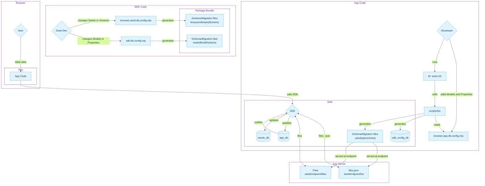
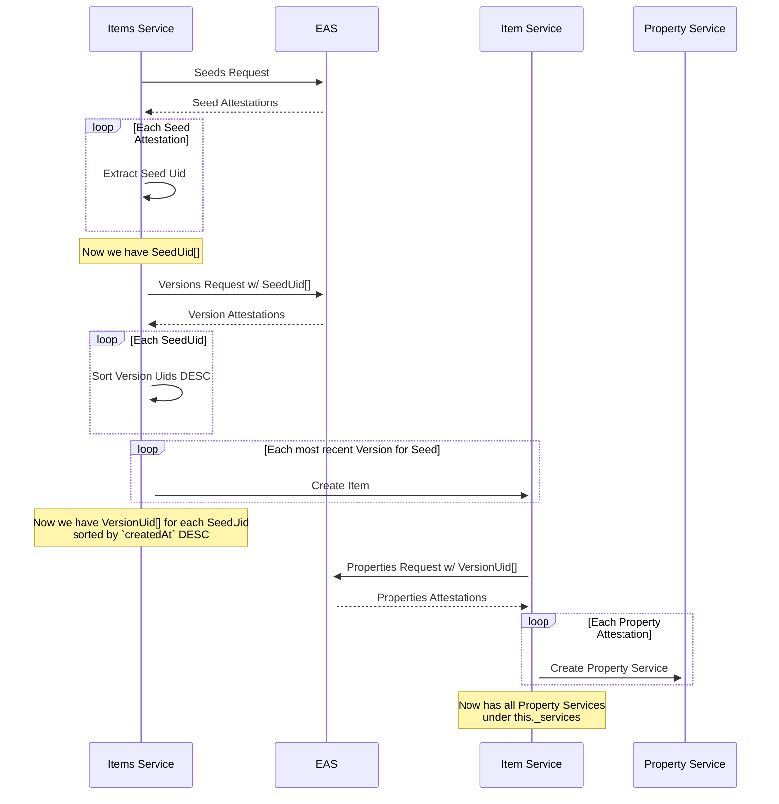

# Seed Protocol SDK

The official SDK for [Seed Protocol](https://seedprotocol.io/).

The SDK is a heavily opinionated ORM that saves its database (SQLite) and files (OPFS) within the user's browser. All
user data
is fetched from, or written to, the Ethereum Attestation Service (EAS) and Arweave (More attestation services
and decentralized storage providers will be supported in the future).

With all the remote storage on decentralized, public infrastructure, there's no server component to manage or rely on.

The hope is that this local-first and distributed approach will make it easier for developers to build apps with Seed
Protocol
without ever custodying user data on their own infrastructure.

The SDK is currently used and developed by [PermaPress](https://permapress.xyz), the first client for Seed Protocol.
PermaPress is a product developed by JournoLabs (formerly JournoDAO).

## Installing

```bash
yarn add @seedprotocol/sdk
```

## Getting Started

The first thing to do when integrating Seed SDK is define your data model by placing a `schema.ts` file in the root
of your project.

As an example, here's the actual data model for PermaPress:

```typescript
import { ImageSrc, List, Model, Relation, Text } from '@/browser/schema'

@Model
class Image {
  @Text() storageTransactionId!: string
  @Text() uri!: string
  @Text() alt!: string
  @ImageSrc() src!: string
}

@Model
class Post {
  @Text() title!: string
  @Text() summary!: string
  @Relation('Image', 'ImageSrc') featureImage!: string
  @Text('ItemStorage', '/html', '.html') html!: string
  @Text('ItemStorage', '/json', '.json') json!: string
  @Text() storageTransactionId!: string
  @List('Identity') authors!: string[]
  @Text() importUrl!: string
}

@Model
class Identity {
  @Text() name!: string
  @Text() profile!: string
  @Text() displayName!: string
  @Relation('Image', 'ImageSrc') avatarImage!: string
  @Relation('Image', 'ImageSrc') coverImage!: string
}

@Model
class Link {
  @Text() url!: string
  @Text() text!: string
}

const models = {
  Identity,
  Image,
  Link,
  Post,
}

const endpoints = {
  filePaths: '/api/seed/migrations',
  files: '/app-files',
}

export { models, endpoints }

export default { models, endpoints }

```

This will create a database locally in the browser with all the tables and fields necessary to support your Models.

> [!NOTE]
> The database is a SQLite file stored
> in [OPFS](https://developer.mozilla.org/en-US/docs/Web/API/File_System_API/Origin_private_file_system).
> We recommend using
> the [OPFS Explorer](https://chromewebstore.google.com/detail/opfs-explorer/acndjpgkpaclldomagafnognkcgjignd)
> browser extension to see the files managed by the SDK.

Notice that we create relationships by defining a `Property` that takes its related `Model` as its type. For one-to-many
relationships, we use the `List` type and pass in the `Model` type we want.

So creating a Post would look like this:

```typescript
import { Post, Image, Identity } from './seed/models'
import html                      from './index.html'

const image = await Image.create({
  src: 'https://imgr.com/image.jpg',
})

const author = await Identity.create({
  name: 'Keith Axline',
  profile: 'Developer for Seed Protocol',
})

const authors = [
  author
]

const post = await Post.create({
  title: 'Some title',
  summary: 'My summary',
  featureImage: image,
  authors,
})

await post.publish()

// And later when we want to update the post
post.title = 'Something else'

await post.publish()

```

## Usage

### `Item`

Create

```typescript

```

### Files

Subscribe to events:

```typescript
import { SeedFile } from '@seedprotocol/sdk'

const fileFromUrl = new SeedFile('https://example.com/file.txt')

fileFromUrl.subscribe(( event, status ) => {
  console.log(`Event: ${event}, Status: ${status}`)
})

await fileFromUrl.save()

```

Create files from various sources:

```typescript
const fileFromPath = new SeedFile('path/to/file.txt')

const fileFromBlob = new SeedFile(new Blob([ 'Hello, World!' ]))

const fileFromBuffer = new SeedFile(Buffer.from('Hello, World!'))

const fileFromFile = new SeedFile(new File([ 'Hello, World!' ], 'file.txt'))

if ( fileFromPath.isSaved ) {
  console.log('File is saved to Arweave and EAS')
}
```

Use the `SeedFileSystem`

```typescript
import { SeedFileSystem } from '@seedprotocol/sdk'

const fs = new SeedFileSystem()

fs.subscribe(( event, status ) => {
  console.log(`Event: ${event}, Status: ${status}`)
  if ( event === 'connection.success' && status === 'connected' ) {
    console.log('Connected to user\'s file system')
  }

  if ( event === 'connection.error' ) {
    console.error('Error connecting to user\'s file system', event.error)
  }
})

await fs.connect() // User prompted to connect browser wallet

const files = await fs.listFiles('/')

files.forEach(file => {
  console.log(file.name)
  console.log(file.size)
  console.log(file.seedPath) // Each wallet address has a virtual root directory with directories and file system paths
})

```

### Images

```typescript

import { SeedImage } from '@seedprotocol/sdk'

const imgFromUrl = new SeedImage('https://example.com/image.png')

const imgFromDataUrl = new SeedImage('data:image/png;base64,iVB....')

await imgFromUrl.save()

const imgBlob    = imgFromUrl.blob()
const imgBuffer  = imgFromUrl.buffer()
const imgDataUrl = imgFromUrl.dataUrl()

```



A[Versions From EAS]
B[Seeds From EAS]
C[List of Items]
D[List of Properties]
E{Property Machine}
F{Item Machine}
G{Items Machine}


